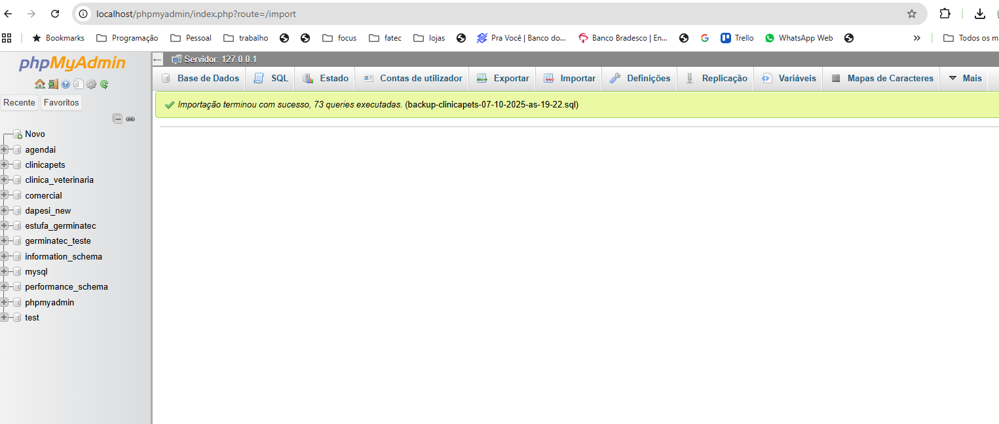

# Projeto clinica para Pets

* Objetivo : Construir projeto back-end com o proprosito de gerenciar uma clinica de atendimento a animais.

### Tecnologias: 
  * **Python** - servidor api
  * **mysql** - banco de dados

### Descritivo projeto:
  * Para cada visita do animal à veterinária deseja-se saber qual o animal e qual o veterinário envolvido nela, a data e o horário de tal atendimento. É necessário ainda, saber qual foi o tratamento indicado pelo veterinário em cada visita. Um tratamento é composto por remédio, dosagens de tais remédios (que podem ser mais de um por visita), data de início e data de fim do tratamento. Sobre os remédios são armazenados apenas o nome e qual o laboratório que o fabrica. Sobre o laboratório é importante saber nome e telefone.

---

### Criando banco de dados e populando informações iniciais

* Instancie o painel de controle do xampp, inicio o serviço banco de dados mysql e apache;

* abra o admin do mysql pelo painel de controle do xampp, este ira carregar no seu navegador padrão o phpadmin que irá permitir a gestão dos bancos de dados mysql no seu pc, caso não esteja utilizando o xampp e sim outro programa ou o banco diretamete utilize o programa de acesso de sua preferencia.

* Voce pode criar o banco com auxilio do script que esta na pasta do projeto src/db de nome `clinicapets.sql`, inserindo o conteúdo em uma sessão  `SQL` do phpadmin e executando os scripts sql, ou importando o backup do banco de dados que esta na raiz do projeto via phpAdmin, escolha uma das duas técnicas.

---
####  Tela nanutenção phpmyadmin

---
#### Der para o projeto clinicapets

---
#### phpmyadmin Exportando um Banco de Dados 
* selecione o banco de dados que deseja exportar/backup e selecione a opção `exportar`;
* na pagina de exportação selecione o modo personalizadoo;

---

#### phpmyadmin Exportando um Banco de Dados 
* altere a configuração : **Adicionar declaração CREATE DATABASE / USE** para ativo.

---

#### phpmyadmin Exportando um Banco de Dados 
* role a tela até o final e click em exportar / salvar / continuar;

---

#### phpmyadmin Exportando um Banco de Dados 
* escolha o local para salvar o backup do banco de dados e informe o nome para o arquivo;
* padronizaremos o nome do arquivo de backup para: `backup-<nome-banco-dados>-<dia>-as-<hora-minuto>.sql`
`backup-clinicapets-07-10-2025-as-19-22.sql`

---

#### phpmyadmin Importando um Banco de Dados 
* não selecione um banco de dados, clicando no icone de inicio  no menu esquerdo ;
* selecione a opção de importar no menu superior do phpmyadmin;

---

#### phpmyadmin Importando um Banco de Dados 
* click escolher ficheiro ou click no imput para procurar o arquivo de backup.

---

#### phpmyadmin Importando um Banco de Dados 
* localize a pasta e selecione o arquivo que contém o backup para ser restaurado e click em `abrir` ;

----

#### phpmyadmin Importando um Banco de Dados 
* role a tela de importação até o final e click em `importar` e aguarde a conclusão do processo;

---

#### phpmyadmin Importando um Banco de Dados 
* exemplo de processo concluido com sucesso;

---

* selecione o banco de dados e verifique que as tabelas foram criadas e os dados foram recuperados.

---
Atividade Avaliativa

crie os endpoints de todas as tabelas do banco de dados clinicapets e gere os arquivo de teste em restclient ( .http)

* api

| tabela | end-point |  get | getBy | post | put | delete | 
| -------| --------- | -----|-------|------|-----|--------|
| users  | /users    |      |       |      |     |        |
| roles  | /roles    |      |       |      |     |        |
| users_roles  | /userroles    |      |       |      |    |

* testes

| tabela | end-point |  get | getBy | post | put | delete | 
| -------| --------- | -----|-------|------|-----|--------|
| users  | /users    |      |       |      |     |        
| roles  | /roles    |      |       |      |     |        
| users_roles  | /userroles    |      |       |      |     

* os arquivos devem seguir a padronização acordada.